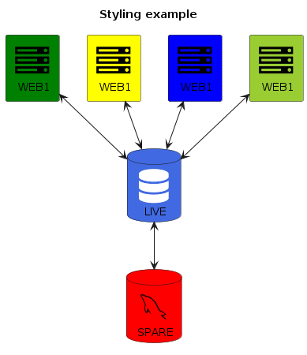

# PlantUML Icon-Font Sprites

## Getting Started

The common.puml is required for the rest to work.

```puml
!include ../common.puml
```

or via url

```puml
!define ICONURL https://raw.githubusercontent.com/tupadr3/plantuml-icon-font-sprites/v2.2.0
!includeurl ICONURL/common.puml
```

Import the sprites that you want

```puml
!include ../devicons/mysql.puml
!include ../font-awesome/database.puml
!include ../font-awesome-5/database.puml
```

or via url

```puml
!includeurl ICONURL/common.puml
!includeurl ICONURL/devicons/mysql.puml
!includeurl ICONURL/font-awesome/database.puml
!includeurl ICONURL/font-awesome-5/database.puml
```

To use the sprites add one of the macros

```puml
DEV_MYSQL(db)
```

The macros are prefixed with the set and the name of the icon

```puml
<prefix>_<name>(alias)
<prefix>_<name>(alias,label)
<prefix>_<name>(alias,label,shape)
<prefix>_<name>(alias,label,shape,color)
```

Using the icon from devicons for mysql

```puml
DEV_MYSQL(db1)
DEV_MYSQL(db2,label of db2)
DEV_MYSQL(db3,label of db3,database)
DEV_MYSQL(db4,label of db4,database,red) #DeepSkyBlue
```


## Icon Sets

The following icon sets are included:

| Name                                                       | Index                                     |
| ---------------------------------------------------------- | ----------------------------------------- |
| [Font-Awesome 4](https://fontawesome.com/v4.7.0/)          | [List of macros](font-awesome/index.md)   |
| [Font-Awesome 5](http://fontawesome.io/)                   | [List of macros](font-awesome-5/index.md) |
| [Devicons](http://vorillaz.github.io/devicons)             | [List of macros](devicons/index.md)       |
| [Govicons](http://govicons.io/)                            | [List of macros](govicons/index.md)       |
| [Weather](https://erikflowers.github.io/weather-icons/)    | [List of macros](weather/index.md)        |
| [Material](http://google.github.io/material-design-icons/) | [List of macros](material/index.md)       |
| [Devicon 2](https://konpa.github.io/devicon/)              | [List of macros](dev2/index.md)           |

## Example

```puml
@startuml

skinparam defaultTextAlignment center

!define ICONURL https://raw.githubusercontent.com/tupadr3/plantuml-icon-font-sprites/v2.2.0

!includeurl ICONURL/common.puml
!includeurl ICONURL/devicons/mysql.puml
!includeurl ICONURL/font-awesome/server.puml
!includeurl ICONURL/font-awesome-5/database.puml

title Styling example

FA_SERVER(web1,WEB1) #Green
FA_SERVER(web2,WEB1) #Yellow
FA_SERVER(web3,WEB1) #Blue
FA_SERVER(web4,WEB1) #YellowGreen

FA5_DATABASE(db1,LIVE,database,white) #RoyalBlue
DEV_MYSQL(db2,SPARE,database) #Red

db1 <--> db2

web1 <--> db1
web2 <--> db1
web3 <--> db1
web4 <--> db1

@enduml
```



More examples can be found [here](examples/)

## Build

Icons are generated with [font-icon-generator](https://github.com/tupadr3/font-icon-generator)

## Note

- All brand icons are trademarks of their respective owners.
- Thanks to milo-minderbinder for [AWS-PlantUML](https://github.com/milo-minderbinder/AWS-PlantUML)
- Thanks to [yuri-becker](https://github.com/yuri-becker) for the integration of [Devicon 2](https://konpa.github.io/devicon/)

## Changelog

### v2.2.0

- Updated all except material to latest version
- Updated material to 3.0.2

### v2.1.0

- Added Devicon 2

### v2.0.0

- Added fa5, weather, gov and material
- Updated dev and fa to latest version
- Fixed aspect ratios

### v1.0.0

- Intital release

Enjoy!
