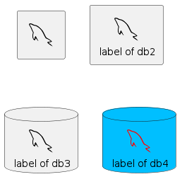

# PlantUML Icon-Font Sprites

## Getting Started

The common.puml is required for the sprites to work.

```puml
!$ICONURL = "icons"
!include $ICONURL/common.puml
```

or via url

```puml
!$ICONURL = "https://raw.githubusercontent.com/tupadr3/plantuml-icon-font-sprites/v3.0.0/icons"
!include $ICONURL/common.puml
```

Import the sprites that you want

```puml
!include $ICONURL/common.puml
!include $ICONURL/devicons/mysql.puml
!include $ICONURL/font-awesome/database.puml
!include $ICONURL/font-awesome-5/database.puml
```

To use the sprites add one of the macros

```puml
DEV_MYSQL(db)
```

The macros are prefixed with the set and the name of the icon

```puml
<prefix>_<name>(alias)
<prefix>_<name>(alias,label)
<prefix>_<name>(alias,label,shape)
<prefix>_<name>(alias,label,shape,color)
```

Using the icon from devicons for mysql

```puml
DEV_MYSQL(db1)
DEV_MYSQL(db2,label of db2)
DEV_MYSQL(db3,label of db3,database)
DEV_MYSQL(db4,label of db4,database,red) #DeepSkyBlue
```



## Icon Sets

An overview of all icons can be here:

[Overview](https://html-preview.github.io/?url=https://github.com/tupadr3/plantuml-icon-font-sprites/blob/v3.0.0/icons/index.html)

The following icon sets are included:

| Name                                                       | Index                                           |
| ---------------------------------------------------------- | ----------------------------------------------- |
| [Font-Awesome 4](https://fontawesome.com/v4.7.0/)          | [List of macros](icons/font-awesome/index.md)   |
| [Font-Awesome 5](http://fontawesome.io/)                   | [List of macros](icons/font-awesome-5/index.md) |
| [Font-Awesome 6](http://fontawesome.io/)                   | [List of macros](icons/font-awesome-6/index.md) |
| [Devicons](http://vorillaz.github.io/devicons)             | [List of macros](icons/devicons/index.md)       |
| [Govicons](http://govicons.io/)                            | [List of macros](icons/govicons/index.md)       |
| [Weather](https://erikflowers.github.io/weather-icons/)    | [List of macros](icons/weather/index.md)        |
| [Material](http://google.github.io/material-design-icons/) | [List of macros](icons/material/index.md)       |
| [Devicon 2](https://github.com/devicons/devicon.git)       | [List of macros](icons/devicons2/index.md)      |

## Example

```puml
@startuml

skinparam defaultTextAlignment center

!$ICONURL = "https://raw.githubusercontent.com/tupadr3/plantuml-icon-font-sprites/v3.0.0/icons"
!include $ICONURL/common.puml

!include $ICONURL/common.puml
!include $ICONURL/devicons/mysql.puml
!include $ICONURL/font-awesome/server.puml
!include $ICONURL/font-awesome-5/database.puml

title Styling example

FA_SERVER(web1,WEB1) #Green
FA_SERVER(web2,WEB1) #Yellow
FA_SERVER(web3,WEB1) #Blue
FA_SERVER(web4,WEB1) #YellowGreen

FA5_DATABASE(db1,LIVE,database,white) #RoyalBlue
DEV_MYSQL(db2,SPARE,database) #Red

db1 <--> db2

web1 <--> db1
web2 <--> db1
web3 <--> db1
web4 <--> db1

@enduml
```


More examples can be found [here](examples/)

## Build

### Windows

```bash
npm install --global --production windows-build-tools
yarn install
yarn build
```

### Linux

```bash
apt install librsvg2-bin openjdk-11-jre graphviz
yarn install
yarn build
```

## Note

- All brand icons are trademarks of their respective owners.
- Thanks to milo-minderbinder for [AWS-PlantUML](https://github.com/milo-minderbinder/AWS-PlantUML)
- Thanks to [yuri-becker](https://github.com/yuri-becker) for the integration of [Devicon 2](https://konpa.github.io/devicon/)
- Thanks to [tfc](https://github.com/tfc) for the html template [Issue](https://github.com/tupadr3/plantuml-icon-font-sprites/issues/29)

## Contributing

Contribution is welcome. In order to update an existing font or to add a new font please fork the repository and use a feature branch.

## Changelog

### v3.0.0

- **Breaking change**: Moved all generated assets to a new subfolder "icons"
- Added index.html with all icons in one html file
- Added FA6
- Updated FA5 to latest v5.X
- Updated FA4 to latest v4.X
- Updated devicons2 to version v2.16.0
- Repo reorga, devcontainer support, ...
- Updated deps

### v2.4.0

- Updated devicons2 & pinned to v2.12.0
- Integrated project [font-icon-generator](https://github.com/tupadr3/font-icon-generator) into this project to make it easier to contribute

### v2.3.0

- Fixed wrong link in readme to devicons2
- Changed Repo for devicons2 to <https://github.com/devicons/devicon.git>
- Removed old dir "dev2"
- Updated FA5 to latest v5.15.3
- Updated devicons2 to latest version
- Pinned gov to 5.15.3

### v2.2.0

- Updated all except material to latest version
- Updated material to 3.0.2

### v2.1.0

- Added Devicon 2

### v2.0.0

- Added fa5, weather, gov and material
- Updated dev and fa to latest version
- Fixed aspect ratios

### v1.0.0

- Intital release

Enjoy!
