# devicons

### Overview
| Name  | Macro  | Image | Url |
|-------|--------|-------|-----|
|android |DEV_ANDROID | | android.puml |
|appcelerator |DEV_APPCELERATOR | | appcelerator.puml |
|angular_simple |DEV_ANGULAR_SIMPLE | | angular_simple.puml |
|appstore |DEV_APPSTORE | | appstore.puml |
|apple |DEV_APPLE | | apple.puml |
|aptana |DEV_APTANA | | aptana.puml |
|aws |DEV_AWS |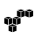 | aws.puml |
|atlassian |DEV_ATLASSIAN | | atlassian.puml |
|backbone |DEV_BACKBONE | | backbone.puml |
|asterisk |DEV_ASTERISK | | asterisk.puml |
|bing_small |DEV_BING_SMALL | | bing_small.puml |
|bintray |DEV_BINTRAY | | bintray.puml |
|atom |DEV_ATOM | | atom.puml |
|bitbucket |DEV_BITBUCKET | | bitbucket.puml |
|blackberry |DEV_BLACKBERRY | | blackberry.puml |
|bootstrap |DEV_BOOTSTRAP | | bootstrap.puml |
|bower |DEV_BOWER | | bower.puml |
|brackets |DEV_BRACKETS | | brackets.puml |
|cisco |DEV_CISCO | | cisco.puml |
|bugsense |DEV_BUGSENSE | | bugsense.puml |
|celluloid |DEV_CELLULOID | | celluloid.puml |
|chrome |DEV_CHROME | | chrome.puml |
|clojure |DEV_CLOJURE |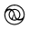 | clojure.puml |
|clojure_alt |DEV_CLOJURE_ALT | | clojure_alt.puml |
|cloud9 |DEV_CLOUD9 | | cloud9.puml |
|codepen |DEV_CODEPEN | | codepen.puml |
|codeigniter |DEV_CODEIGNITER | | codeigniter.puml |
|code |DEV_CODE | | code.puml |
|coda |DEV_CODA | | coda.puml |
|code_badge |DEV_CODE_BADGE | | code_badge.puml |
|coffeescript |DEV_COFFEESCRIPT | | coffeescript.puml |
|codrops |DEV_CODROPS | | codrops.puml |
|compass |DEV_COMPASS | | compass.puml |
|css3_full |DEV_CSS3_FULL | | css3_full.puml |
|composer |DEV_COMPOSER | | composer.puml |
|css3 |DEV_CSS3 | | css3.puml |
|creativecommons_badge |DEV_CREATIVECOMMONS_BADGE | | creativecommons_badge.puml |
|creativecommons |DEV_CREATIVECOMMONS | | creativecommons.puml |
|css_tricks |DEV_CSS_TRICKS | | css_tricks.puml |
|cssdeck |DEV_CSSDECK | | cssdeck.puml |
|dart |DEV_DART | | dart.puml |
|dlang |DEV_DLANG | | dlang.puml |
|debian |DEV_DEBIAN |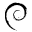 | debian.puml |
|database |DEV_DATABASE | | database.puml |
|django |DEV_DJANGO | | django.puml |
|digital_ocean |DEV_DIGITAL_OCEAN | | digital_ocean.puml |
|doctrine |DEV_DOCTRINE | | doctrine.puml |
|docker |DEV_DOCKER | | docker.puml |
|dreamweaver |DEV_DREAMWEAVER | | dreamweaver.puml |
|eclipse |DEV_ECLIPSE | | eclipse.puml |
|dojo |DEV_DOJO | | dojo.puml |
|drupal |DEV_DRUPAL | | drupal.puml |
|dropbox |DEV_DROPBOX | | dropbox.puml |
|dotnet |DEV_DOTNET | | dotnet.puml |
|ember |DEV_EMBER | | ember.puml |
|erlang |DEV_ERLANG | | erlang.puml |
|envato |DEV_ENVATO | | envato.puml |
|firefox |DEV_FIREFOX | | firefox.puml |
|extjs |DEV_EXTJS | | extjs.puml |
|ghost |DEV_GHOST | | ghost.puml |
|fsharp |DEV_FSHARP | | fsharp.puml |
|firebase |DEV_FIREBASE |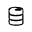 | firebase.puml |
|ghost_small |DEV_GHOST_SMALL | | ghost_small.puml |
|github_alt |DEV_GITHUB_ALT | | github_alt.puml |
|github |DEV_GITHUB | | github.puml |
|git |DEV_GIT | | git.puml |
|git_branch |DEV_GIT_BRANCH |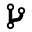 | git_branch.puml |
|github_badge |DEV_GITHUB_BADGE | | github_badge.puml |
|git_commit |DEV_GIT_COMMIT | | git_commit.puml |
|github_full |DEV_GITHUB_FULL | | github_full.puml |
|git_compare |DEV_GIT_COMPARE | | git_compare.puml |
|git_merge |DEV_GIT_MERGE | | git_merge.puml |
|google_analytics |DEV_GOOGLE_ANALYTICS | | google_analytics.puml |
|git_pull_request |DEV_GIT_PULL_REQUEST |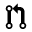 | git_pull_request.puml |
|go |DEV_GO |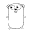 | go.puml |
|google_cloud_platform |DEV_GOOGLE_CLOUD_PLATFORM | | google_cloud_platform.puml |
|gnu |DEV_GNU | | gnu.puml |
|google_drive |DEV_GOOGLE_DRIVE | | google_drive.puml |
|grails |DEV_GRAILS | | grails.puml |
|groovy |DEV_GROOVY | | groovy.puml |
|hackernews |DEV_HACKERNEWS | | hackernews.puml |
|gulp |DEV_GULP | | gulp.puml |
|grunt |DEV_GRUNT | | grunt.puml |
|haskell |DEV_HASKELL | | haskell.puml |
|heroku |DEV_HEROKU | | heroku.puml |
|html5 |DEV_HTML5 | | html5.puml |
|html5_connectivity |DEV_HTML5_CONNECTIVITY | | html5_connectivity.puml |
|html5_3d_effects |DEV_HTML5_3D_EFFECTS | | html5_3d_effects.puml |
|html5_device_access |DEV_HTML5_DEVICE_ACCESS | | html5_device_access.puml |
|ie |DEV_IE | | ie.puml |
|html5_multimedia |DEV_HTML5_MULTIMEDIA | | html5_multimedia.puml |
|illustrator |DEV_ILLUSTRATOR | | illustrator.puml |
|intellij |DEV_INTELLIJ | | intellij.puml |
|ionic |DEV_IONIC | | ionic.puml |
|java |DEV_JAVA | | java.puml |
|jenkins |DEV_JENKINS | | jenkins.puml |
|jekyll_small |DEV_JEKYLL_SMALL | | jekyll_small.puml |
|javascript_1 |DEV_JAVASCRIPT_1 | | javascript_1.puml |
|jquery_logo |DEV_JQUERY_LOGO | | jquery_logo.puml |
|jira |DEV_JIRA | | jira.puml |
|joomla |DEV_JOOMLA | | joomla.puml |
|javascript |DEV_JAVASCRIPT | | javascript.puml |
|js_badge |DEV_JS_BADGE | | js_badge.puml |
|jquery_ui_logo |DEV_JQUERY_UI_LOGO | | jquery_ui_logo.puml |
|komodo |DEV_KOMODO | | komodo.puml |
|laravel |DEV_LARAVEL |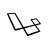 | laravel.puml |
|krakenjs_badge |DEV_KRAKENJS_BADGE | | krakenjs_badge.puml |
|krakenjs |DEV_KRAKENJS | | krakenjs.puml |
|less |DEV_LESS | | less.puml |
|linux |DEV_LINUX | | linux.puml |
|magento |DEV_MAGENTO | | magento.puml |
|mailchimp |DEV_MAILCHIMP | | mailchimp.puml |
|markdown |DEV_MARKDOWN | | markdown.puml |
|materializecss |DEV_MATERIALIZECSS | | materializecss.puml |
|mitlicence |DEV_MITLICENCE | | mitlicence.puml |
|meteor |DEV_METEOR | | meteor.puml |
|meteorfull |DEV_METEORFULL | | meteorfull.puml |
|modernizr |DEV_MODERNIZR | | modernizr.puml |
|mongodb |DEV_MONGODB | | mongodb.puml |
|msql_server |DEV_MSQL_SERVER |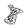 | msql_server.puml |
|mootools_badge |DEV_MOOTOOLS_BADGE |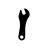 | mootools_badge.puml |
|mootools |DEV_MOOTOOLS | | mootools.puml |
|mysql |DEV_MYSQL | | mysql.puml |
|mozilla |DEV_MOZILLA | | mozilla.puml |
|netbeans |DEV_NETBEANS | | netbeans.puml |
|nancy |DEV_NANCY | | nancy.puml |
|nodejs |DEV_NODEJS | | nodejs.puml |
|netmagazine |DEV_NETMAGAZINE | | netmagazine.puml |
|npm |DEV_NPM | | npm.puml |
|onedrive |DEV_ONEDRIVE | | onedrive.puml |
|nodejs_small |DEV_NODEJS_SMALL | | nodejs_small.puml |
|openshift |DEV_OPENSHIFT | | openshift.puml |
|opensource |DEV_OPENSOURCE | | opensource.puml |
|nginx |DEV_NGINX | | nginx.puml |
|opera |DEV_OPERA | | opera.puml |
|phonegap |DEV_PHONEGAP | | phonegap.puml |
|perl |DEV_PERL | | perl.puml |
|prolog |DEV_PROLOG | | prolog.puml |
|python |DEV_PYTHON | | python.puml |
|photoshop |DEV_PHOTOSHOP | | photoshop.puml |
|php |DEV_PHP | | php.puml |
|postgresql |DEV_POSTGRESQL | | postgresql.puml |
|rackspace |DEV_RACKSPACE | | rackspace.puml |
|react |DEV_REACT | | react.puml |
|rasberry_pi |DEV_RASBERRY_PI |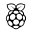 | rasberry_pi.puml |
|redis |DEV_REDIS | | redis.puml |
|raphael |DEV_RAPHAEL | | raphael.puml |
|redhat |DEV_REDHAT | | redhat.puml |
|requirejs |DEV_REQUIREJS | | requirejs.puml |
|responsive |DEV_RESPONSIVE |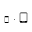 | responsive.puml |
|ror |DEV_ROR | | ror.puml |
|ruby |DEV_RUBY | | ruby.puml |
|rust |DEV_RUST | | rust.puml |
|scriptcs |DEV_SCRIPTCS | | scriptcs.puml |
|sass |DEV_SASS | | sass.puml |
|scala |DEV_SCALA | | scala.puml |
|safari |DEV_SAFARI | | safari.puml |
|ruby_rough |DEV_RUBY_ROUGH | | ruby_rough.puml |
|scrum |DEV_SCRUM |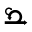 | scrum.puml |
|snap_svg |DEV_SNAP_SVG | | snap_svg.puml |
|spark |DEV_SPARK | | spark.puml |
|smashing_magazine |DEV_SMASHING_MAGAZINE |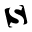 | smashing_magazine.puml |
|sizzlejs |DEV_SIZZLEJS | | sizzlejs.puml |
|stackoverflow |DEV_STACKOVERFLOW | | stackoverflow.puml |
|senchatouch |DEV_SENCHATOUCH | | senchatouch.puml |
|sqllite |DEV_SQLLITE | | sqllite.puml |
|stylus |DEV_STYLUS | | stylus.puml |
|swift |DEV_SWIFT | | swift.puml |
|symfony_badge |DEV_SYMFONY_BADGE | | symfony_badge.puml |
|sublime |DEV_SUBLIME | | sublime.puml |
|techcrunch |DEV_TECHCRUNCH | | techcrunch.puml |
|symfony |DEV_SYMFONY |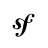 | symfony.puml |
|terminal |DEV_TERMINAL | | terminal.puml |
|streamline |DEV_STREAMLINE |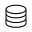 | streamline.puml |
|terminal_badge |DEV_TERMINAL_BADGE | | terminal_badge.puml |
|travis |DEV_TRAVIS | | travis.puml |
|typo3 |DEV_TYPO3 | | typo3.puml |
|ubuntu |DEV_UBUNTU | | ubuntu.puml |
|trello |DEV_TRELLO | | trello.puml |
|uikit |DEV_UIKIT | | uikit.puml |
|unity_small |DEV_UNITY_SMALL | | unity_small.puml |
|vim |DEV_VIM | | vim.puml |
|webplatform |DEV_WEBPLATFORM | | webplatform.puml |
|wordpress |DEV_WORDPRESS | | wordpress.puml |
|visualstudio |DEV_VISUALSTUDIO | | visualstudio.puml |
|windows |DEV_WINDOWS | | windows.puml |
|w3c |DEV_W3C | | w3c.puml |
|yahoo |DEV_YAHOO | | yahoo.puml |
|yeoman |DEV_YEOMAN | | yeoman.puml |
|yahoo_small |DEV_YAHOO_SMALL |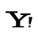 | yahoo_small.puml |
|zend |DEV_ZEND | | zend.puml |
|yii |DEV_YII | | yii.puml |
